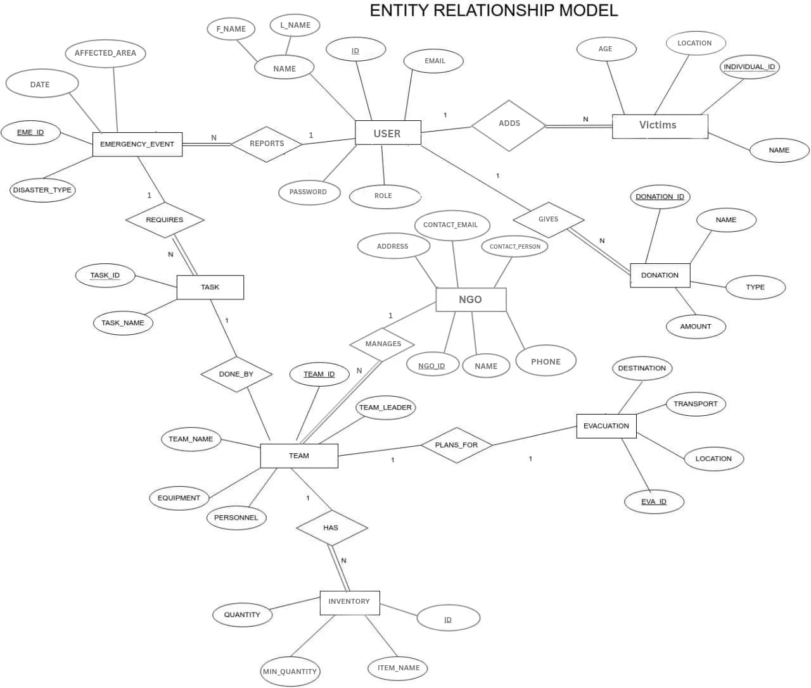
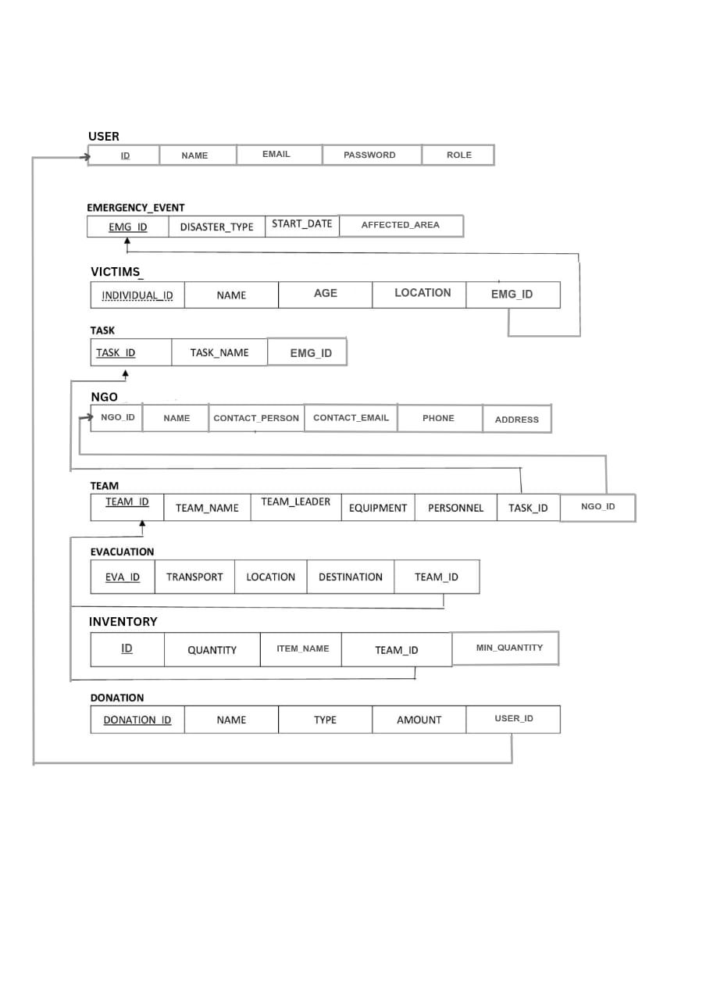
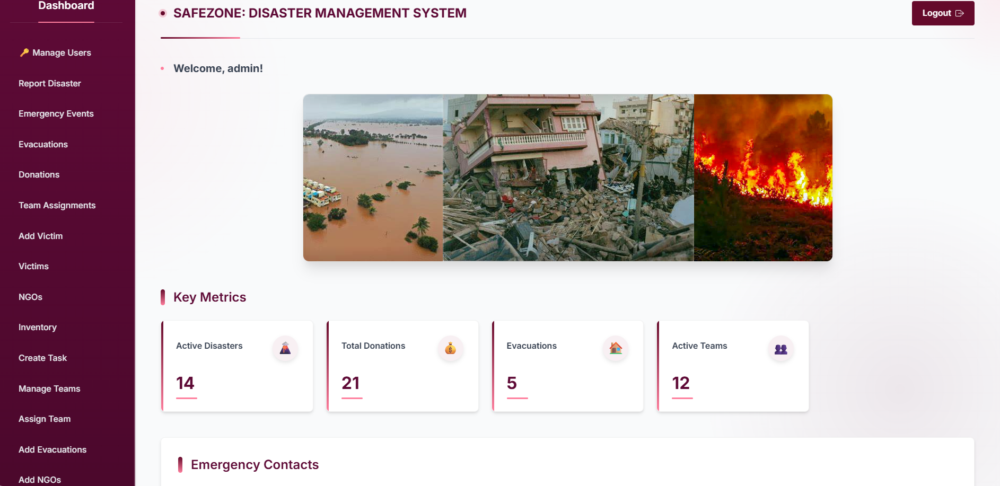
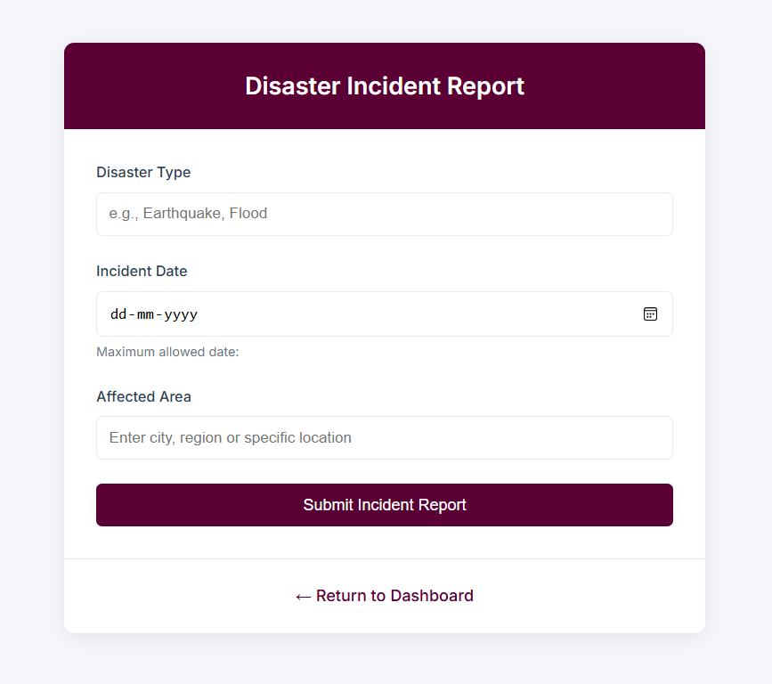
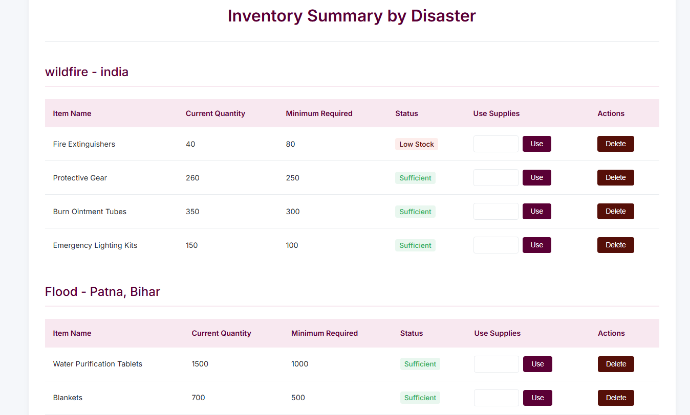

# Centralized Emergency Response System

A Flask-based web application designed to streamline disaster management through real-time incident reporting, multi-stakeholder coordination and intelligent resource allocation. Featuring role-based access control (Admin/User), dynamic inventory management and automated alert systems, this solution leverages SQLAlchemy for efficient data handling and Jinja2 templating for responsive interfaces. The platform reduces emergency response times by centralizing victim data, optimizing relief distributiona and providing actionable dashboards for all authorized stakeholders.

---

## Tech Stack

**Frontend**: HTML5, CSS3, JavaScript, Jinja2

**Backend**: Python (Flask), SQLite (PostgreSQL-compatible), SQLAlchemy

**Utilities**: Flask-WTF, Flask-Migrate, Bcrypt, Geopy

**Development**: Visual Studio Code

---

##  Features by Role

### Admin Features

* Admin dashboard with separate secure login.
* Full CRUD operations for:

  * Disasters
  * Victims
  * Aid Requirements
  * Inventories
  * Evacuations
  * Tasks
  * NGOs & their Teams
  * Donations
* Admins can assign tasks and teams to specific disaster events.
* Full control over **evacuation logistics**, including transport details and assigned team.
* Inventory oversight for each disaster, including **threshold alerts** for minimum stock.
* All operations are **logged and validated**, with constraints to avoid duplicates or missing links.
* Manage evacuation logistics including transport and destination.
* Monitor inventory levels with alerts for minimum stock thresholds.
* Smart validation to avoid duplicate or broken entries.
* Real-time system messages for admin feedback.
* **Robust security**: hashed passwords, CSRF protection, and secure sessions.


###  User Side Features

* A dedicated interface with separate login for general users.
* Users can **report disasters**, specifying type, date, and affected area.
* Users can **view a list of all reported emergencies** and related data like victims, aid, and teams.
* Allows users to **register and manage victim information**.
* Prevents duplicate entries for the same disaster using **smart constraints**.
* Secure form submissions with **CSRF protection** and input validation.
* Users are notified of important actions via flash messages.

---

## Default Admin Credentials (Demo Access)
For demonstration purposes, you can log in using the default administrator account:

**Email**: admin@gmail.com
**Password**: admin123

---

## Setup Instructions

### Prerequisites:

* Python 3.10+
* Git (optional)

### 1. Clone the Repository

```bash
git clone https://github.com/Angeline-Neha/disaster-management.git
cd disaster-management
```

### 2. Create and Activate Virtual Environment

```bash
python -m venv venv
# On Windows:
venv\Scripts\activate
# On macOS/Linux:
source venv/bin/activate
```

### 3. Install Dependencies

```bash
pip install -r requirements.txt
```

### 4. Set Up the Database

```bash
flask db init
flask db migrate -m "Initial migration"
flask db upgrade
```

### 5. Run the App

```bash
flask run
```

Go to `http://127.0.0.1:5000/` in your browser.

---


## Database Design

### Entity Relationship Diagram (ERD)



### Database Schema



---

##  Snapshots

### 🔹 Admin Dashboard


### 🔹 Disaster Reporting Form


### 🔹 Inventory Management


